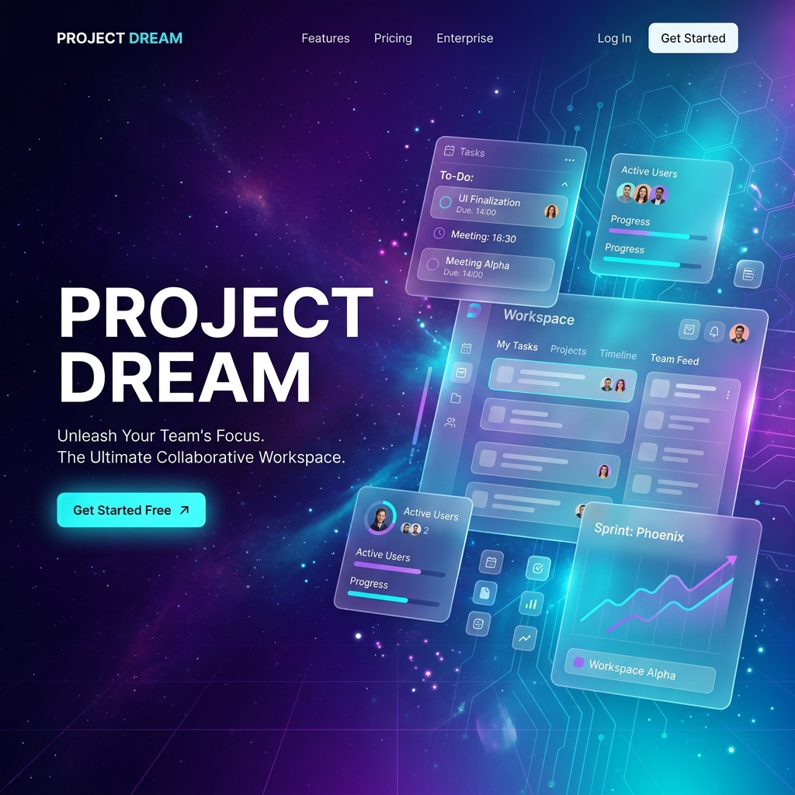

# 🌙 Project Dream (DreamTask)

> **"Where productivity meets aesthetic fluidity."**  
> A Next-Gen Notion-style collaborative workspace engineered for teams who value both power and visual excellence.

[](https://nextjs.org/)
[](https://expressjs.com/)
[](https://www.prisma.io/)
[](https://www.meilisearch.com/)
[](https://redis.io/)

---

## 🎯 The Vision

Productivity tools often force a choice: **Utility or Beauty**. *Project Dream* was built to eliminate that compromise. It's a high-performance Monorepo architecture that delivers a "Zero-Latency" feel through intelligent caching, a lightning-fast search engine, and glassmorphism-inspired UI components.

## ✨ Core Pillars (ฟีเจอร์หลัก)


### ✍️ Intelligent Writing Experience
- **Block-based Editor**: Powered by **TipTap**, supporting multi-level headers, interactive checklists, and collaborative blocks.
- **Dynamic Content**: Real-time sanitation and rendering using **DOMPurify** for secure, rich content.

### 📊 Fluid Workflow Orchestration
- **Performance-First Kanban**: Handles hundreds of tasks with smooth drag-and-drop transitions powered by **dnd-kit**.
- **Real-time Sync**: Changes are reflected instantly across the team using a robust API and future-proofed for WebSockets.

### 🔍 Advanced Search Engine (Meilisearch)
- **Instant Search**: Sub-millisecond search results with typo-tolerance.
- **Global Indexing**: Every task, note, and team member is indexed for immediate retrieval.

---

## 🛠️ Technical Excellence (Engineering Highlights)

### **Modern Stack**
| Layer | Technologies |
| :--- | :--- |
| **Frontend** | `Next.js 14` (App Router), `Tailwind CSS`, `Framer Motion`, `Zustand` |
| **Backend** | `Node.js`, `Express.js`, `TypeScript`, `Prisma ORM` |
| **Storage & Search** | `PostgreSQL`, `Meilisearch` (Search Engine), `Redis` (Caching) |
| **Infrastructure** | `pnpm Workspaces` (Monorepo), `Docker Compose` |

### **Architecture Overview**
- **Monorepo Strategy**: Shared types and database schemas across `api` and `web` for type-safety and maintenance.
- **Database Scalability**: Optimized queries using Prisma Transactions and indexed PostgreSQL fields.
- **Security**: JWT-based stateless authentication with secure password hashing and invitation-only onboarding flows.

---

## 🚀 Deployment & Local Setup

### 1. Development Environment
```bash
# Clone the repository
git clone https://github.com/yourusername/project-dream.git

# Install dependencies via pnpm
pnpm install

# Start core services (Postgres, Redis, Meilisearch)
docker-compose up -d
```

### 2. Database Initialization
```bash
# Sync Prisma schema
pnpm db:push

# Generate Prisma Client for all packages
pnpm build:db
```

### 3. Launch
```bash
# Run both Frontend & Backend in high-performance dev mode
pnpm dev
```

---

## 🎨 UI/UX Philosophy
- **Minimalist Aesthetic**: High-contrast dark mode with neon accents.
- **Micro-Animations**: Staggered navigation fades and spring-based transitions for a "Premium" feel.
- **Glassmorphism**: Layered transparency to create depth and hierarchy without visual clutter.

---

## 👨‍💻 Author & Contributions
Project Dream is maintained and engineered by **Your Name**.  
Building the future of collaborative tools, one block at a time.

---
*Built with ❤️ and a passion for clean code & beautiful design.*
