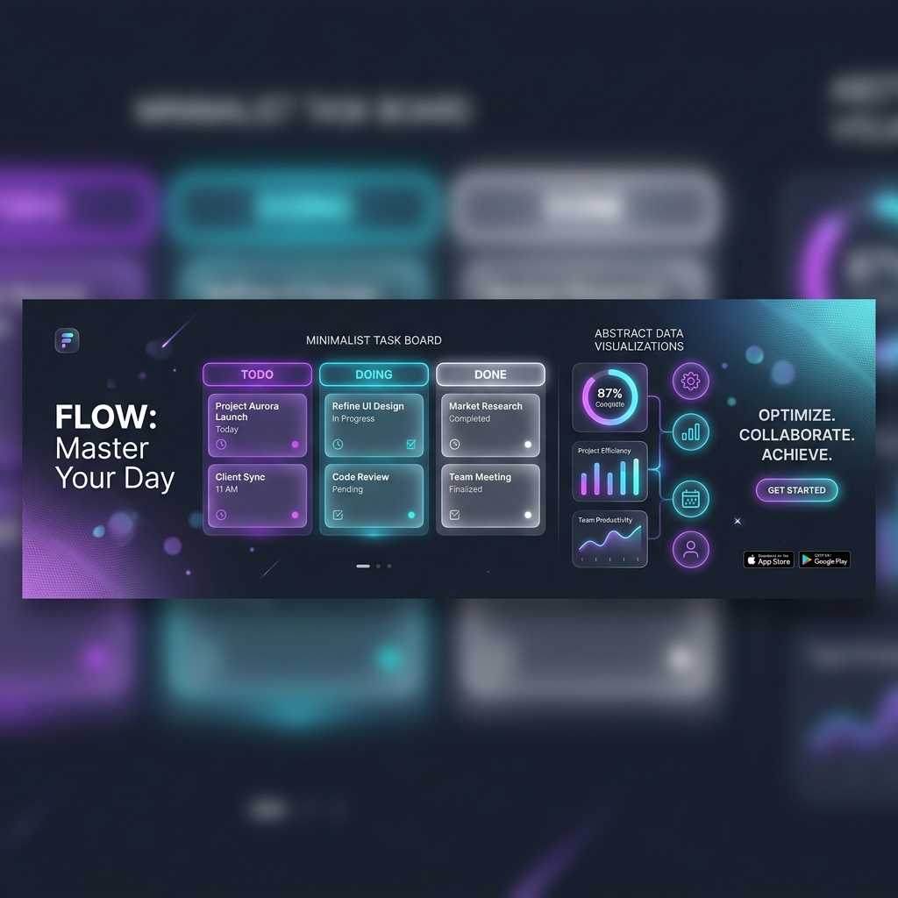

# 🌙 Project Dream (Notions)

> **Next-Gen Notion-Style Collaborative Workspace**
> แพลตฟอร์มจัดการงานระดับสูงที่เน้นความสวยงามและการใช้งานที่ไหลลื่น เหมือนมี Notion เป็นของตัวเอง

---

<p align="center">
  
  
  
  
  
  
</p>

## ✨ Key Features (คุณสมบัติเด่น)



*   📝 **Block-based Rich Text Editor**: หน้าเขียนโน้ตและงานที่ทรงพลังด้วย **TipTap** รองรับ tables, checklists, และ dynamic sub-tasks.
*   📋 **Advanced Kanban Boards**: จัดการ workflow ของทีมด้วยบอร์ดที่ลื่นไหล (Smooth Drag & Drop) ขับเคลื่อนโดย **dnd-kit**.
*   👥 **Team Collaboration**: ระบบทีมที่สมบูรณ์แบบ รองรับการเชิญสมาชิก (Invitations) และการสลับ Workspace ที่รวดเร็ว.
*   🔐 **Enterprise-grade Auth**: ระบบล็อกอินที่ปลอดภัย (JWT) พร้อมฟีเจอร์ Reset Password และ Auto-register จากลิงก์คำเชิญ.
*   ⚡ **High Performance Backend**: สถาปัตยกรรม Monorepo ที่ใช้ **Redis Caching** และ **Prisma Transactions** เพื่อความเสถียรสูงสุด.

---

## 🛠️ Technical Stack (เทคโนโลยีที่ใช้)

### Frontend
- **Framework**: `Next.js 14` (App Router)
- **Styling**: `Tailwind CSS`, `Framer Motion` (Animations)
- **State Management**: `Zustand`, `TanStack Query` (React Query)
- **Editor Core**: `TipTap`
- **UI Components**: `Radix UI`, `Lucide Icons`

### Backend
- **Server**: `Express.js` with `TypeScript`
- **Database**: `PostgreSQL` via `Prisma ORM`
- **Caching**: `Redis`
- **Authentication**: `JSON Web Tokens (JWT)`, `Bcrypt`

---

## 📂 Project Structure (โครงสร้างโปรเจกต์)

```bash
project-dream/
├── apps/
│   ├── api/          # Express API Backend (Business Logic & Models)
│   └── web/          # Next.js Frontend (UI & Components)
├── packages/
│   └── db/           # Shared Prisma Schema & Client
├── scripts/          # Automation & Development Utilities
└── pnpm-workspace.yaml
```

---

## 🚀 Getting Started (วิธีการติดตั้ง)

### 1. Prerequisites (สิ่งที่ต้องเตรียม)
- **Node.js**: v18.x or onwards
- **pnpm**: v8.x or onwards
- **Docker**: For running PostgreSQL & Redis (Optional)

### 2. Installation (ดาวน์โหลดและติดตั้ง)
```bash
# ติดตั้ง dependencies ทั้งหมด
pnpm install

# ตั้งค่า Environment Variables
# สร้างไฟล์ .env ใน root และ apps/api, apps/web ตามลำดับ
cp .env.example .env
```

### 3. Database Setup (ตั้งค่าฐานข้อมูล)
```bash
# Push schema ไปยัง database
pnpm db:push

# Generate Prisma Client
pnpm --filter @taskapp/db generate
```

### 4. Run Development (เริ่มโหมดนักพัฒนา)
```bash
# รันทั้ง Frontend และ Backend พร้อมกัน
pnpm dev
```

---

## 🎨 UI/UX Design Goals
- **Minimalism**: เน้นความสะอาดตา ลด Noise เพื่อเพิ่มสมาธิในการทำงาน.
- **Micro-interactions**: ทุกการคลิกและการลากมีความละมุนด้วย Framer Motion.
- **Glassmorphism**: ใช้เอฟเฟกต์ความโปร่งใสและเบลอเพื่อความพรีเมียม.

---

## 🤝 Contribution
โปรเจกต์นี้ได้รับการพัฒนาอย่างต่อเนื่อง หากต้องการส่งข้อเสนอแนะหรือแจ้ง Bug สามารถเปิด Issue ได้ทันที!

Built with ❤️ by **Team Project Dream**
