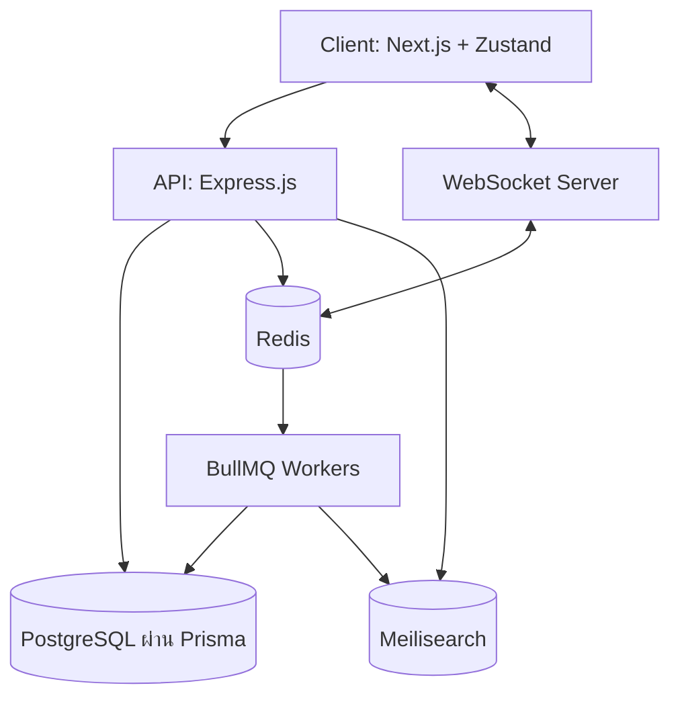

# Project Dream - สรุปภาพรวมสถาปัตยกรรมสำหรับ Senior/AI

## 1. System Architecture Diagram

แผนภาพด้านล่างแสดงสถาปัตยกรรมระบบโดยรวม เพื่อให้เห็นความสัมพันธ์ระหว่าง Frontend, Backend และโครงสร้างพื้นฐาน (Infrastructure) อื่นๆ



## 2. Core Data Flow (การไหลของข้อมูลจริง)

### Auth Flow (ระบบล็อกอิน)
1. User ทำการล็อกอินผ่าน Google OAuth หรือใช้อีเมล/รหัสผ่านที่ Next.js ฝั่ง Client
2. Client ส่ง payload ข้อมูลการล็อกอินไปที่ Express API (`POST /api/auth/login`)
3. API ตรวจสอบความถูกต้อง, สร้าง JWT (และบันทึกลงใน HTTP-only cookie เพื่อการจัดการ session) และอาจจะมี refresh token
4. ตัว JWT จะถูกคืนค่ากลับไปและถูกใช้งานเป็นหลักผ่าน HTTP-only cookie เวลาเรียก API เพื่อความปลอดภัย
5. สำหรับ Request หลังจากนั้น `authenticateUser` middleware ของ API จะดึง JWT จาก Cookie มาตรวจสอบ และแนบข้อมูลลงใน `req.user` ให้ Controller เอาไปใช้ต่อ

### Task Management Flow (TipTap & Block Editor)
1. User สร้างหรือแก้ไข Task โดยใช้ TipTap Block Editor บน Next.js Client
2. State ของ Editor ทั้งหมดจะถูก sync และจัดการผ่าน Zustand store
3. Client จะทำ debounce และคอยส่ง `PATCH /api/tasks/:id` พร้อมกับข้อมูล JSON/HTML ใหม่ไปหา API
4. Express API ตรวจสอบข้อมูลด้วย Zod, นำข้อมูลไปอัปเดตตาราง `Task` ใน PostgreSQL ผ่าน Prisma
5. API กระตุ้น event ข้ามไปให้ BullMQ เพื่อนำข้อมูล Task ใหม่ไปอัปเดต Index ใน Meilisearch
6. WebSocket server ส่ง event realtime กระจายอัปเดตไปให้ Client อื่นๆ ของคนในทีมเดียวกันที่กำลังเปิดหน้าจออยู่

## 3. API Structure

โครงสร้าง API (`apps/api/src/`) ถูกออกแบบมาแยกส่วนประกอบให้ชัดเจน:

```
apps/api/src/
  ├── config.ts         # Environment variables & ค่าคงที่ต่างๆ
  ├── index.ts          # จุดเริ่มต้นของ Server (Entry point)
  ├── routes/           # Express Routers (ชั้นบางๆ ควบคุมเส้นทาง)
  ├── models/           # ชั้นจัดการข้อมูลทางธุรกิจ (Business logic และ Prisma wrappers)
  ├── middleware/       # Auth, error handling, validation ชั้นกลาง
  └── services/         # ระบบเชื่อมต่อภายนอกและบริการเสริม (Redis, Email, ฯลฯ)
```

**Conventions (ข้อตกลง):**
- **REST vs RPC:** ออกแบบ API ส่วนใหญ่เป็น RESTful (`GET /tasks`, `POST /tasks`) แต่บางแอคชันที่ซับซ้อนก็ยอมให้ใช้แบบ RPC ได้ (`POST /tasks/:id/assign`).
- **Response Format:**
  - สำเร็จ (Success): คืนค่ารูปแบบ `res.status(200).json({ data: [...], message: "Success" })`
  - ผิดพลาด (Error): จะถูกส่งให้ `next(error)` และนำไปจัดการรวมที่ Global error handler เสมอ.

## 4. State Management Flow

ฝั่ง Next.js ใช้ Zustand เป็น Global state ที่เบาและเร็ว โดยมี Flow ประมาณนี้:

`UI Component` ➔ `Zustand Store` ➔ `API Call (fetch/axios)` ➔ `Database (PostgreSQL)`

1. **UI Component:** เรียกใช้งานฟังก์ชันที่อยู่ใน Zustand store (เช่น กดปุ่ม `addTask`).
2. **Zustand Store:** ทำ Optimistic update (อัปเดต UI ให้ผู้ใช้เห็นทันทีก่อนรอผลลัพธ์) จากนั้นค่อยเรียก API async
3. **API Call:** ยิง Request ส่งข้อมูลไปหา Express
4. หาก API ส่ง Error กลับมา, Zustand จะ Rollback ข้อมูลใน UI กลับ และแสดง Toast แจ้งเตือนข้อผิดพลาดให้ดู

## 5. Error Handling & Logging

ดักจับ Error ที่ไม่ได้ถูกจัดการ (Unhandled exception) ทั้งหมดในแอป Express ไปรวมไว้ที่ Global error handler

**API Error Format:**
```json
{
  "error": "Not Found",
  "message": "Task with ID 123 does not exist.",
  "statusCode": 404
}
```

**Logging Strategy:**
- ใช้ `pino` (และ `pino-pretty` สำหรับตอน dev) เพื่อให้ Log ออกมาเป็นรูปแบบโครงสร้าง JSON
- ใช้ `logger.info()`, `logger.warn()`, `logger.error()` แทนที่ `console.log()` เพื่อให้ง่ายต่อการนำ Log ไปต่อยอดกับระบบเช่น Datadog หรือ CloudWatch

## 6. Scaling Considerations (ส่วนสำคัญสำหรับสเกลระบบและจัดทำ Portfolio)

สถาปัตยกรรมนี้ถูกออกแบบมารองรับทั้ง Vertical และ Horizontal Scale:
- **Stateless API:** ระบบล็อกอินเป็น JWT-based ตัว Express node ไหนก็สามารถรับ Request ได้ทันที ไม่มีการเก็บ Session ไว้ใน Memory ของเซิร์ฟเวอร์
- **Redis for Queue/Cache:** งานไหนที่หนักหรือกินเวลา (เช่น Re-indexing ข้อมูลค้นหา, ส่งอีเมล) จะโยนลง Queue (BullMQ) ทั้งหมดเพื่อลดทอนเวลารอบนเส้นทางหลัก
- **Meilisearch สำหรับค้นหาเร็วปรู๊ด:** ปลดภาระให้ PostgreSQL ไม่ต้องมาค้นหาแบบ Wildcard (`%LIKE%`) หนักๆ อีกต่อไป ด้วยการโยนไปให้ Meilisearch ตอบกลับด้วยระดับ sub-50ms แทน
